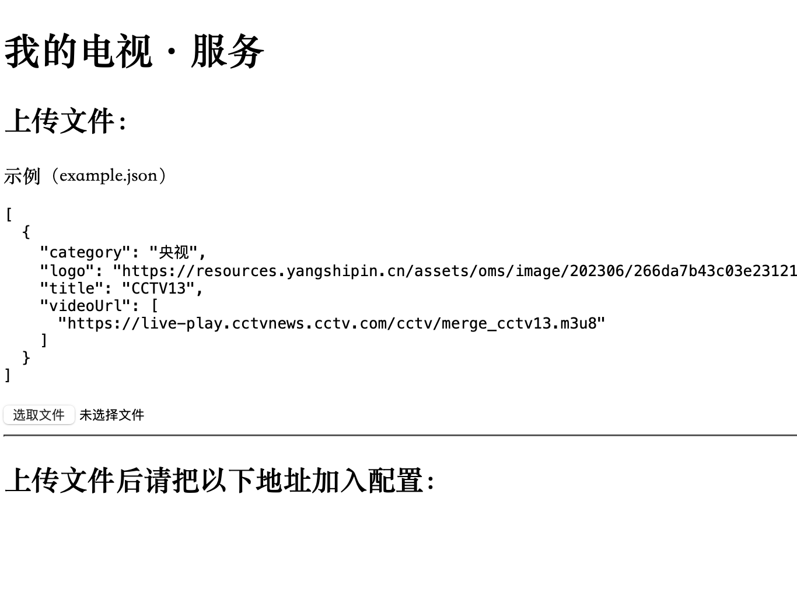

# 我的电视·服务

启动一个本地的视频源服务。为了更好的稳定性、隐私性、便捷性，可以把一个视频源文件发布到一个本地地址，添加到本地视频播放器。

[my-tv-server](https://github.com/lizongying/my-tv-server)

## 功能

1. 支持原始输出（保持格式不变，所以除了“我的电视·〇”，也可以配置到其他软件）
2. 支持json、txt、m3u之间格式转换（目前支持txt、m3u转换成json，可以方便地配置到“我的电视·〇”）
3. 支持发布到本地、局域网、公网（本地地址“127.0.0.1”，仅供查看或本机使用，不能设置到其他设备上，如本服务在windows上启动，而软件在安卓上）
4. 支持linux、mac、windows系统
5. 支持配置到“我的电视·〇”等视频播放器

## 下载

[releases](https://github.com/lizongying/my-tv-0/releases/latest)

## 用法

1. 下载程序
2. 启动程序
3. 进入网址
4. 上传文件
5. 配置地址

```shell
./my-tv-server
```

* 默认端口8000，使用其他端口 `--port 8001`

测试文件：
* [example_encode.json](./assets/example_encode.json)
* [example_encode.m3u](./assets/example_encode.m3u)
* [example_encode.txt](./assets/example_encode.txt)

注：使用了[gua64](https://github.com/lizongying/go-gua64)编码



## 测试

```shell
go run ./cmd/server/*
```

## 构建

```shell
make
```

## 镜像

[ghcr.io](https://github.com/lizongying/my-tv-server/pkgs/container/my-tv-server)

[hub.docker.com](https://hub.docker.com/r/lizongying/my-tv-server)

## 赞赏

